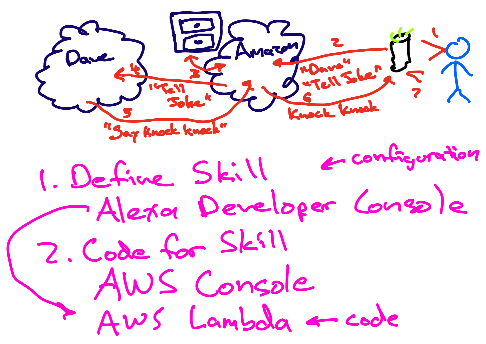
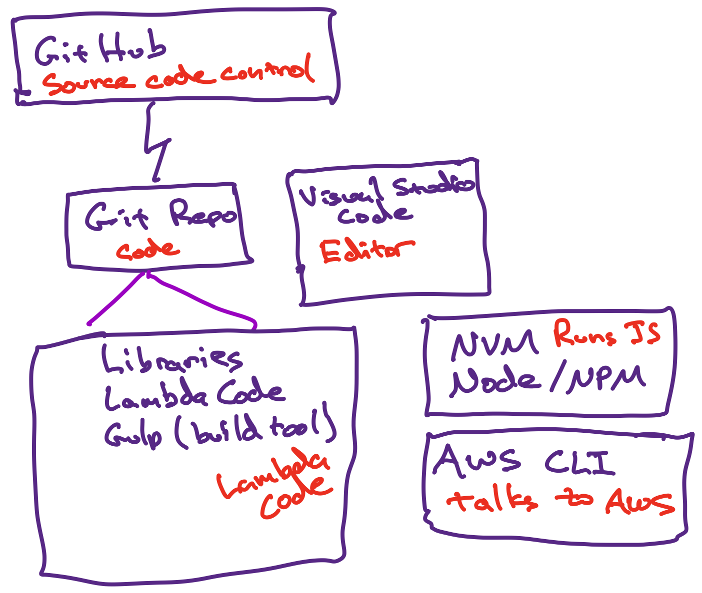

In this tutorial, we're going to build and run an Alexa app (called an "Alexa skill")  Here's a high-level view of what happens when you use an Alexa skill:

Let's start at the top right:
1. You (the blue person) talk to an Alexa device (such as an Echo, shown in black).  We'll imagine the skill is called "Dave," so you say something like "Alexa, ask Dave to tell a joke"
1. The Alexa device sends your command to some Alexa-handling logic in the Amazon cloud.  It splits up your command to understand that you're talking to the "Dave" skill, and gave it the "Tell Joke" command (a command for a skill is called an "intent", so this would be known as the "Tell Joke intent")
1. Amazon has a filing cabinet somewhere, or a virtual filing cabinet anyway, that has information about each skill, including where the skill runs.  So Amazon looks up the information for the "Dave" skill.
    * Alexa skills can be run anywhere you like, but it's more straightforward to run them in AWS Lambda than anywhere else.  Since that's also free for any normal amount of usage, we'll use it rather than come up with and configure some other hosting provider.
1. Now knowing where the "Dave" skill lives, the Amazon cloud calls Dave, wherever it may be.  (In our case, in Lambda in the AWS cloud.)  It tells the Dave skill that you've given it the Tell Joke intent.
1. Dave decides what to do.  In this case, it might tell Alexa to say "Knock, knock".  It replies to the Amazon cloud with that instruction.
1. The Amazon cloud tells your Echo device to say "Knock, knock"
1. The Echo device says "Knock, knock"

## What you need on your Mac to work with this Alexa skill:

**All of these things will be installed as part of the tutorial!**

**All of these things will be installed as part of the tutorial!**

1. For starters, we'll use source code control from GitHub.  It will have the "master" copy of your code, which can be shared between people or across several machines.  The set of code for a single project is called a "repository", so GitHub has your repository in the cloud
1. On your machine, you'll have a local Git repository, with the copy of the code on your machine.
1. Inside that repository, you'll have your working copy of the code that should run in AWS Lambda.  It will use some code written by other people and made available for your use -- these are called "libraries".  And you'll have a copy of the helper tool called "Gulp" that can do things like send code from your local machine to AWS Lambda to run there.
1. Elsewhere on your machine, you'll have the Visual Studio Code app, which you use to actually edit the code and configuration files for this skill.
1. You'll also have some tools needed to work with JavaScript files.  We're using JavaScript for this because it's well-supported, runs fast in AWS Lambda, and is useful to know in a world of Web apps.
    * Node runs JavaScript tools and apps on your machine
    * NPM is part of Node -- the Node Package Manager -- that knows how to install libraries and tools for a JavaScript project
    * Unfortunately, there are a large number of Node versions out there, that can sometimes conflict.  We use NVM, the Node Version Manager, to control exactly which version of Node a given project will use.  This is especially important because AWS Lambda uses specific versions of Node, and we don't want to use an incompatible version by accident.
1. Finally, you need the AWS Command-Line Interface (AWS CLI) tool to work with AWS.  You can inspect and update your AWS configuration that way.  Gulp uses the AWS CLI under the covers to send your code to run in AWS Lambda.

## Next Steps

The step-by-step tutorial starts with [Running your first Lambda](tutorial1.md), which includes setting up all the tools we talked about above, and running a simple Lambda like in the top diagram.